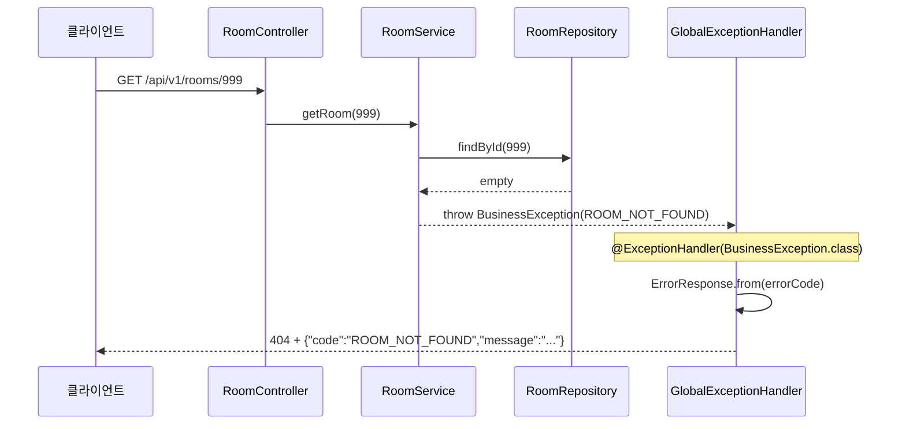

# Architecture

프로젝트의 주요 구조와 요청/예외 흐름을 기록합니다.

## API Endpoints

현재 구현·노출 중인 HTTP API입니다. 인증 정책은 `SecurityConfig` 기준입니다.

### 요약

| Method | Path                     | 인증                  | 설명                           |
| ------ | ------------------------ | --------------------- | ------------------------------ |
| `GET`  | `/actuator/health`       | 불필요                | 애플리케이션·DB 헬스 체크      |
| `GET`  | `/actuator/info`         | **필요** (HTTP Basic) | 애플리케이션 정보              |
| `GET`  | `/api/v1/rooms`          | 불필요                | 공간 목록 조회 (필터 optional) |
| `GET`  | `/api/v1/rooms/{roomId}` | 불필요                | 공간 상세 조회                 |

> 그 외 경로는 HTTP Basic 인증이 필요합니다. (개발용 임시, JWT로 교체 예정)

---

### `GET /actuator/health`

**인증:** 불필요

**응답 예시:**

```json
{
  "groups": ["liveness", "readiness"],
  "status": "UP"
}
```

---

### `GET /actuator/info`

**인증:** HTTP Basic 필요

Actuator `info` endpoint. `application.properties`에서 `health`, `info`만 노출 중입니다.

---

### `GET /api/v1/rooms`

**인증:** 불필요

**Query parameters (모두 optional):**

| Parameter     | Type      | 설명                                       |
| ------------- | --------- | ------------------------------------------ |
| `status`      | `String`  | `ACTIVE`, `INACTIVE`, `MAINTENANCE`        |
| `minCapacity` | `Integer` | 최소 수용 인원 (`capacity >= minCapacity`) |
| `maxCapacity` | `Integer` | 최대 수용 인원 (`capacity <= maxCapacity`) |

**예시:**

```http
GET /api/v1/rooms
GET /api/v1/rooms?status=ACTIVE
GET /api/v1/rooms?minCapacity=4&maxCapacity=8
GET /api/v1/rooms?status=ACTIVE&minCapacity=4&maxCapacity=8
```

**응답 (200):**

```json
{
  "items": [
    {
      "id": 1,
      "name": "Focus Room A",
      "location": "2층",
      "capacity": 4,
      "status": "ACTIVE"
    }
  ]
}
```

**에러 (400):** 잘못된 `status`, 또는 `minCapacity > maxCapacity`

```json
{
  "code": "INVALID_REQUEST",
  "message": "잘못된 요청입니다."
}
```

---

### `GET /api/v1/rooms/{roomId}`

**인증:** 불필요

**Path parameter:**

| Parameter | Type   | 설명    |
| --------- | ------ | ------- |
| `roomId`  | `Long` | 공간 ID |

**응답 (200):**

```json
{
  "id": 1,
  "name": "Focus Room A",
  "location": "2층",
  "capacity": 4,
  "status": "ACTIVE"
}
```

**에러 (404):** 존재하지 않는 ID

```json
{
  "code": "ROOM_NOT_FOUND",
  "message": "공간을 찾을 수 없습니다."
}
```

---

### 공통 에러 응답

`BusinessException` 발생 시 `GlobalExceptionHandler`가 아래 형식으로 변환합니다.

```json
{
  "code": "ERROR_CODE",
  "message": "사용자에게 보여줄 메시지"
}
```

| HTTP | code              | 사용처 (현재)                    |
| ---- | ----------------- | -------------------------------- |
| 400  | `INVALID_REQUEST` | 잘못된 필터 파라미터             |
| 404  | `ROOM_NOT_FOUND`  | 없는 공간 ID                     |
| 401  | (Spring Security) | 인증 필요 API에 credentials 없음 |

---

## 유저 생성 흐름

```
POST /api/v1/auth/signup
    ↓
AuthController.signup()     ← HTTP만 받음
    ↓
AuthService.signup()        ← ★ 여기서 User 객체 만들고 저장 ★
    ↓
UserRepository.save(user)   ← JPA → INSERT INTO users
    ↓
UserResponse.from(savedUser) 반환
```

## 공통 예외 처리 흐름

존재하지 않는 공간 조회(`GET /api/v1/rooms/999`) 시 예외가 처리되는 경로입니다.

### 시퀀스 다이어그램



### ASCII 흐름

```text
RoomService                          GlobalExceptionHandler              클라이언트
──────────                          ──────────────────────              ──────────
findById(999) → empty
    │
    ▼
throw new BusinessException(         @ExceptionHandler 잡음
  ErrorCode.ROOM_NOT_FOUND )  ──→       │
         │                              ▼
         │                    ErrorResponse.from(errorCode)
         │                              │
         │                              ▼
         └──────────────────→  404 + { "code": "ROOM_NOT_FOUND", ... }
```

### 계층별 역할

| 계층    | 클래스                   | 역할                         |
| ------- | ------------------------ | ---------------------------- |
| 정의    | `ErrorCode`              | 에러 종류, HTTP 상태, 메시지 |
| Service | `BusinessException`      | 비즈니스 규칙 위반 시 throw  |
| Advice  | `GlobalExceptionHandler` | 예외 → HTTP 응답 변환        |
| 응답    | `ErrorResponse`          | 클라이언트 JSON body         |
