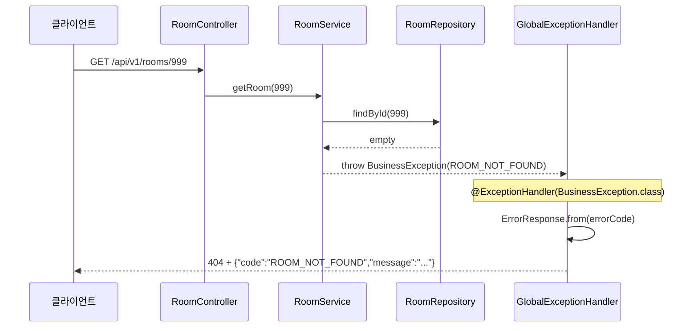

# Architecture

프로젝트의 주요 구조와 요청/예외 흐름을 기록합니다.

## 공통 예외 처리 흐름

존재하지 않는 공간 조회(`GET /api/v1/rooms/999`) 시 예외가 처리되는 경로입니다.

### 시퀀스 다이어그램



### ASCII 흐름

```text
RoomService                          GlobalExceptionHandler              클라이언트
──────────                          ──────────────────────              ──────────
findById(999) → empty
    │
    ▼
throw new BusinessException(         @ExceptionHandler 잡음
  ErrorCode.ROOM_NOT_FOUND )  ──→       │
         │                              ▼
         │                    ErrorResponse.from(errorCode)
         │                              │
         │                              ▼
         └──────────────────→  404 + { "code": "ROOM_NOT_FOUND", ... }
```

### 계층별 역할

| 계층    | 클래스                   | 역할                         |
| ------- | ------------------------ | ---------------------------- |
| 정의    | `ErrorCode`              | 에러 종류, HTTP 상태, 메시지 |
| Service | `BusinessException`      | 비즈니스 규칙 위반 시 throw  |
| Advice  | `GlobalExceptionHandler` | 예외 → HTTP 응답 변환        |
| 응답    | `ErrorResponse`          | 클라이언트 JSON body         |
