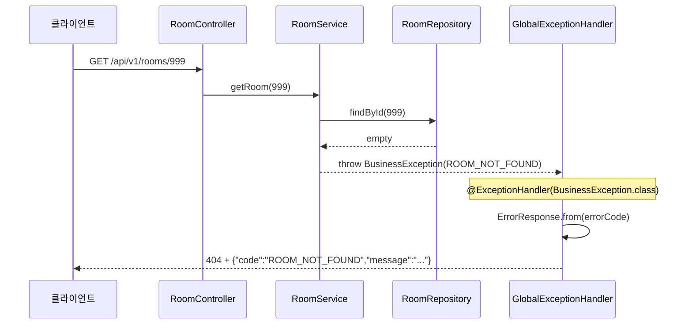

# Architecture

프로젝트의 주요 구조와 요청/예외 흐름을 기록합니다.

## API Endpoints

현재 구현·노출 중인 HTTP API입니다. 인증 정책은 `SecurityConfig` 기준입니다.

### 인증 정책

| 구분 | 경로 | 인증 |
| ---- | ---- | ---- |
| 공개 | `/actuator/health`, `/api/v1/auth/**`, `/api/v1/rooms/**` | 불필요 |
| 보호 | 그 외 (예: `/api/v1/me`, `/actuator/info`) | **JWT Bearer** (`Authorization: Bearer {accessToken}`) |

- 세션 없음 (`STATELESS`). HTTP Basic / form login 비활성.
- Access Token: JWT. Refresh Token: opaque 문자열, DB에는 SHA-256 hash만 저장 (`refresh_tokens`).

### 요약

| Method | Path                     | 인증           | 설명                              |
| ------ | ------------------------ | -------------- | --------------------------------- |
| `GET`  | `/actuator/health`       | 불필요         | 애플리케이션·DB 헬스 체크         |
| `GET`  | `/actuator/info`         | JWT Bearer     | 애플리케이션 정보                 |
| `POST` | `/api/v1/auth/signup`    | 불필요         | 회원가입                          |
| `POST` | `/api/v1/auth/login`     | 불필요         | 로그인 (access + refresh 발급)    |
| `POST` | `/api/v1/auth/refresh`   | 불필요         | refresh로 새 access 발급          |
| `POST` | `/api/v1/auth/logout`    | 불필요         | refresh 1건 revoke (항상 204)     |
| `GET`  | `/api/v1/me`             | JWT Bearer     | 현재 인증 사용자 정보             |
| `GET`  | `/api/v1/rooms`          | 불필요         | 공간 목록 조회 (필터 optional)    |
| `GET`  | `/api/v1/rooms/{roomId}` | 불필요         | 공간 상세 조회                    |

---

### `GET /actuator/health`

**인증:** 불필요

**응답 예시:**

```json
{
  "groups": ["liveness", "readiness"],
  "status": "UP"
}
```

---

### `GET /actuator/info`

**인증:** JWT Bearer 필요

Actuator `info` endpoint. `application.properties`에서 `health`, `info`만 노출 중입니다.

---

### `POST /api/v1/auth/signup`

**인증:** 불필요

**요청:**

```json
{
  "email": "user1@example.com",
  "password": "Password123",
  "name": "June"
}
```

비밀번호: 최소 8자, 대문자 1개 이상.

**응답 (201):** `UserResponse` (password 제외)

**에러:** `EMAIL_ALREADY_EXISTS` (409), `INVALID_REQUEST` (400)

---

### `POST /api/v1/auth/login`

**인증:** 불필요

**요청:**

```json
{
  "email": "user1@example.com",
  "password": "Password123"
}
```

**응답 (200):**

```json
{
  "accessToken": "eyJ...",
  "refreshToken": "a1b2c3...",
  "user": {
    "id": 1,
    "email": "user1@example.com",
    "name": "June",
    "role": "USER",
    "status": "ACTIVE"
  }
}
```

로그인마다 refresh token 원문을 발급하고, DB에는 `token_hash`만 저장합니다. (다중 기기 허용)

**에러:** `INVALID_CREDENTIALS` (401), `INVALID_REQUEST` (400)

---

### `POST /api/v1/auth/refresh`

**인증:** 불필요 (access 만료 후에도 호출 가능)

**요청:**

```json
{
  "refreshToken": "..."
}
```

**응답 (200):**

```json
{
  "accessToken": "eyJ..."
}
```

**에러:** `INVALID_REFRESH_TOKEN` (401) — 없음 / revoke됨 / 만료

---

### `POST /api/v1/auth/logout`

**인증:** 불필요

**요청:**

```json
{
  "refreshToken": "..."
}
```

해당 refresh **1건**만 revoke합니다. (다른 기기 세션은 유지)

| 상황 | HTTP |
| ---- | ---- |
| 유효한 refresh | 204 (revoke) |
| 이미 revoke / 만료 / DB에 없음 | 204 (idempotent, 정보 노출 최소화) |
| body 빈 값 | 400 `INVALID_REQUEST` |

---

### `GET /api/v1/me`

**인증:** JWT Bearer 필요

```http
Authorization: Bearer {accessToken}
```

`@AuthenticationPrincipal AuthUser`로 토큰의 userId를 받고, DB에서 최신 `UserResponse`를 반환합니다.

**에러:** 토큰 없음/invalid → 401 (Spring Security). 사용자 없음 → `USER_NOT_FOUND` (404)

---

### `GET /api/v1/rooms`

**인증:** 불필요

**Query parameters (모두 optional):**

| Parameter     | Type      | 설명                                       |
| ------------- | --------- | ------------------------------------------ |
| `status`      | `String`  | `ACTIVE`, `INACTIVE`, `MAINTENANCE`        |
| `minCapacity` | `Integer` | 최소 수용 인원 (`capacity >= minCapacity`) |
| `maxCapacity` | `Integer` | 최대 수용 인원 (`capacity <= maxCapacity`) |

**예시:**

```http
GET /api/v1/rooms
GET /api/v1/rooms?status=ACTIVE
GET /api/v1/rooms?minCapacity=4&maxCapacity=8
GET /api/v1/rooms?status=ACTIVE&minCapacity=4&maxCapacity=8
```

**응답 (200):**

```json
{
  "items": [
    {
      "id": 1,
      "name": "Focus Room A",
      "location": "2층",
      "capacity": 4,
      "status": "ACTIVE"
    }
  ]
}
```

**에러 (400):** 잘못된 `status`, 또는 `minCapacity > maxCapacity`

```json
{
  "code": "INVALID_REQUEST",
  "message": "잘못된 요청입니다."
}
```

---

### `GET /api/v1/rooms/{roomId}`

**인증:** 불필요

**Path parameter:**

| Parameter | Type   | 설명    |
| --------- | ------ | ------- |
| `roomId`  | `Long` | 공간 ID |

**응답 (200):**

```json
{
  "id": 1,
  "name": "Focus Room A",
  "location": "2층",
  "capacity": 4,
  "status": "ACTIVE"
}
```

**에러 (404):** 존재하지 않는 ID

```json
{
  "code": "ROOM_NOT_FOUND",
  "message": "공간을 찾을 수 없습니다."
}
```

---

### 공통 에러 응답

`BusinessException` 발생 시 `GlobalExceptionHandler`가 아래 형식으로 변환합니다.

```json
{
  "code": "ERROR_CODE",
  "message": "사용자에게 보여줄 메시지"
}
```

| HTTP | code                     | 사용처 (현재)                          |
| ---- | ------------------------ | -------------------------------------- |
| 400  | `INVALID_REQUEST`        | 잘못된 필터·validation                 |
| 401  | `INVALID_CREDENTIALS`    | 로그인 실패                            |
| 401  | `INVALID_REFRESH_TOKEN`  | refresh 실패                           |
| 401  | (Spring Security)        | 보호 API에 Bearer 없음/invalid JWT     |
| 404  | `ROOM_NOT_FOUND`         | 없는 공간 ID                           |
| 404  | `USER_NOT_FOUND`         | `/me` 등에서 사용자 없음               |
| 409  | `EMAIL_ALREADY_EXISTS`   | 이메일 중복 가입                       |

---

## JWT 인증 흐름

보호 API (`GET /api/v1/me` 등) 요청 시:

```text
Authorization: Bearer {accessToken}
        │
        ▼
JwtAuthenticationFilter
  - Bearer 추출
  - JwtTokenProvider.parseAccessToken()
  - AuthUser(id, email, role) → SecurityContext
  - filterChain.doFilter()
        │
        ▼
authorizeHttpRequests (authenticated)
        │
        ▼
Controller (@AuthenticationPrincipal AuthUser)
```

토큰이 없거나 invalid이면 `SecurityContext`가 비어 보호 API는 401입니다. 공개 API는 필터를 통과해도 인증 없이 동작합니다.

---

## 로그인·Refresh Token 흐름

```text
POST /api/v1/auth/login
    ↓
AuthService.login()
    ↓
accessToken = JwtTokenProvider.createAccessToken(user)   ← JWT
refreshToken = JwtTokenProvider.createRefreshToken()     ← opaque UUID
    ↓
RefreshTokenHasher.hash(refreshToken) → refresh_tokens INSERT
    ↓
LoginResponse(accessToken, refreshToken 원문, user)
```

```text
POST /api/v1/auth/refresh  { refreshToken }
    ↓
hash → findByTokenHash → isActive?
    ↓
새 accessToken 발급
```

```text
POST /api/v1/auth/logout  { refreshToken }
    ↓
hash → findByTokenHash → active면 revoke()
    ↓
항상 204 (없으면 skip)
```

---

## 유저 생성 흐름

```
POST /api/v1/auth/signup
    ↓
AuthController.signup()     ← HTTP만 받음
    ↓
AuthService.signup()        ← ★ 여기서 User 객체 만들고 저장 ★
    ↓
UserRepository.save(user)   ← JPA → INSERT INTO users
    ↓
UserResponse.from(savedUser) 반환
```

## 공통 예외 처리 흐름

존재하지 않는 공간 조회(`GET /api/v1/rooms/999`) 시 예외가 처리되는 경로입니다.

### 시퀀스 다이어그램



### ASCII 흐름

```text
RoomService                          GlobalExceptionHandler              클라이언트
──────────                          ──────────────────────              ──────────
findById(999) → empty
    │
    ▼
throw new BusinessException(         @ExceptionHandler 잡음
  ErrorCode.ROOM_NOT_FOUND )  ──→       │
         │                              ▼
         │                    ErrorResponse.from(errorCode)
         │                              │
         │                              ▼
         └──────────────────→  404 + { "code": "ROOM_NOT_FOUND", ... }
```

### 계층별 역할

| 계층    | 클래스                   | 역할                         |
| ------- | ------------------------ | ---------------------------- |
| 정의    | `ErrorCode`              | 에러 종류, HTTP 상태, 메시지 |
| Service | `BusinessException`      | 비즈니스 규칙 위반 시 throw  |
| Advice  | `GlobalExceptionHandler` | 예외 → HTTP 응답 변환        |
| 응답    | `ErrorResponse`          | 클라이언트 JSON body         |
