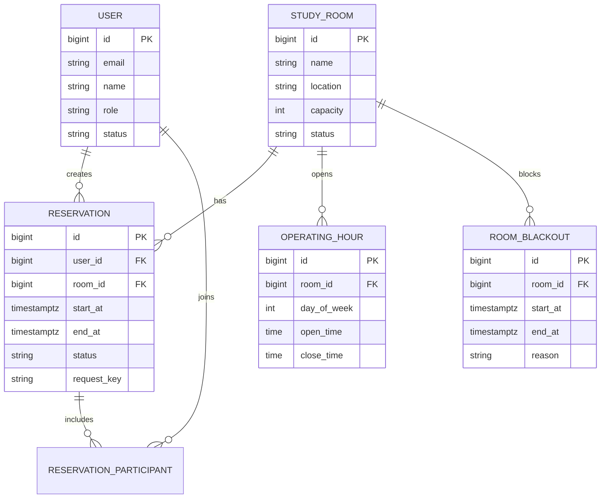

# Spring Boot Study Room Reservation 시스템 설계

다음 설계는 여러 사용자가 스터디룸을 조회하고, 원하는 시간에 예약하거나 취소하는 서비스를 전제로 합니다. 초기에는 단일 Spring Boot 애플리케이션과 PostgreSQL로 시작하는 것이 가장 적절합니다.

## 1. 권장 기술 구성

- Java 21
- Spring Boot 3.x
- Spring Web
- Spring Data JPA
- Spring Security
- PostgreSQL
- Flyway
- Redis 선택 사항
- Testcontainers
- Docker
- AWS, Railway 또는 Kubernetes 배포

처음부터 마이크로서비스로 분리할 필요는 없습니다. 예약의 핵심은 사용자, 공간, 운영시간, 예약 데이터가 강하게 연결되어 있어 모듈형 모놀리스가 구현과 트랜잭션 관리에 유리합니다.

```text
Client
  │
  ▼
Spring Boot API
  ├── Auth
  ├── User
  ├── Room
  ├── Reservation
  ├── Availability
  └── Notification
        │
        ├── PostgreSQL
        ├── Redis (선택)
        └── Email/Push 서비스
```

## 2. 핵심 요구사항

### 사용자

- 회원가입과 로그인
- 일반 사용자와 관리자 구분
- 본인 예약 목록 조회
- 예약 생성 및 취소

### 스터디룸

- 지점 또는 건물별 공간 관리
- 인원수, 위치, 시설 정보
- 운영시간 설정
- 점검 및 휴무 시간 설정
- 관리자의 공간 활성화/비활성화

### 예약

- 특정 시작 시각과 종료 시각 예약
- 같은 공간의 중복 예약 방지
- 최대 예약 시간 제한
- 예약 가능 기간 제한
- 사용자별 동시 예약 개수 제한
- 취소 가능 시간 제한
- 예약 완료, 노쇼 등 상태 관리

## 3. 도메인 관계



## 4. 데이터베이스 설계

### `users`

| 필드            | 타입         | 설명                         |
| --------------- | ------------ | ---------------------------- |
| `id`            | BIGINT       | PK                           |
| `email`         | VARCHAR(255) | 로그인 ID, unique            |
| `password_hash` | VARCHAR(255) | 암호화된 비밀번호            |
| `name`          | VARCHAR(100) | 사용자 이름                  |
| `role`          | VARCHAR(20)  | USER, ADMIN                  |
| `status`        | VARCHAR(20)  | ACTIVE, SUSPENDED, WITHDRAWN |
| `created_at`    | TIMESTAMPTZ  | 생성 시각                    |
| `updated_at`    | TIMESTAMPTZ  | 수정 시각                    |

소셜 로그인만 사용한다면 `password_hash` 대신 별도의 `user_identities` 테이블에 OAuth 제공자와 외부 사용자 ID를 저장할 수 있습니다.

### `study_rooms`

| 필드          | 타입         | 설명                          |
| ------------- | ------------ | ----------------------------- |
| `id`          | BIGINT       | PK                            |
| `name`        | VARCHAR(100) | 공간 이름                     |
| `location`    | VARCHAR(255) | 위치                          |
| `description` | TEXT         | 상세 설명                     |
| `capacity`    | INTEGER      | 최대 수용 인원                |
| `status`      | VARCHAR(20)  | ACTIVE, INACTIVE, MAINTENANCE |
| `created_at`  | TIMESTAMPTZ  | 생성 시각                     |
| `updated_at`  | TIMESTAMPTZ  | 수정 시각                     |
| `version`     | BIGINT       | 낙관적 잠금 버전              |

시설 정보가 유동적이면 `room_amenities` 테이블을 별도로 두는 것이 좋습니다.

```text
amenities
- id
- code: WHITEBOARD, MONITOR, PROJECTOR
- name

room_amenities
- room_id
- amenity_id
```

### `room_operating_hours`

| 필드          | 타입     | 설명      |
| ------------- | -------- | --------- |
| `id`          | BIGINT   | PK        |
| `room_id`     | BIGINT   | 공간 FK   |
| `day_of_week` | SMALLINT | 1~7       |
| `open_time`   | TIME     | 운영 시작 |
| `close_time`  | TIME     | 운영 종료 |

공간별 운영시간이 같다면 지점 단위 운영시간을 만들고 공간이 이를 참조하게 확장할 수 있습니다.

### `room_blackouts`

휴무, 점검, 관리자 차단 시간을 표현합니다.

| 필드         | 타입         |
| ------------ | ------------ |
| `id`         | BIGINT       |
| `room_id`    | BIGINT       |
| `start_at`   | TIMESTAMPTZ  |
| `end_at`     | TIMESTAMPTZ  |
| `reason`     | VARCHAR(255) |
| `created_by` | BIGINT       |
| `created_at` | TIMESTAMPTZ  |

### `reservations`

| 필드                | 타입         | 설명           |
| ------------------- | ------------ | -------------- |
| `id`                | BIGINT       | PK             |
| `user_id`           | BIGINT       | 예약자         |
| `room_id`           | BIGINT       | 예약 공간      |
| `start_at`          | TIMESTAMPTZ  | 시작 시각      |
| `end_at`            | TIMESTAMPTZ  | 종료 시각      |
| `participant_count` | INTEGER      | 이용 인원      |
| `purpose`           | VARCHAR(255) | 이용 목적      |
| `status`            | VARCHAR(20)  | 예약 상태      |
| `request_key`       | UUID         | 중복 요청 방지 |
| `cancelled_at`      | TIMESTAMPTZ  | 취소 시각      |
| `cancel_reason`     | VARCHAR(255) | 취소 사유      |
| `created_at`        | TIMESTAMPTZ  | 생성 시각      |
| `updated_at`        | TIMESTAMPTZ  | 수정 시각      |

권장 상태는 다음과 같습니다.

```text
CONFIRMED → CANCELLED
CONFIRMED → COMPLETED
CONFIRMED → NO_SHOW
```

결제나 관리자 승인이 없다면 `PENDING` 상태는 만들지 않는 편이 좋습니다. 불필요한 중간 상태는 예약 슬롯을 언제부터 점유하는지 복잡하게 만듭니다.

## 5. 중복 예약 방지

이 시스템에서 가장 중요한 부분입니다.

다음 조건이면 두 예약은 겹칩니다.

```text
existing.startAt < requested.endAt
AND
existing.endAt > requested.startAt
```

하지만 애플리케이션에서 겹치는 예약을 조회한 다음 INSERT하는 방식만으로는 충분하지 않습니다.

```text
요청 A: 빈 시간 확인
요청 B: 빈 시간 확인
요청 A: 예약 저장
요청 B: 예약 저장
```

동시에 요청되면 두 요청 모두 성공할 수 있습니다.

### PostgreSQL exclusion constraint 권장

PostgreSQL의 범위 타입과 exclusion constraint를 사용하면 DB가 최종적으로 중복 예약을 막아줍니다.

```sql
CREATE EXTENSION IF NOT EXISTS btree_gist;

ALTER TABLE reservations
ADD CONSTRAINT reservations_valid_period
CHECK (start_at < end_at);

ALTER TABLE reservations
ADD CONSTRAINT reservations_no_overlap
EXCLUDE USING gist (
    room_id WITH =,
    tstzrange(start_at, end_at, '[)') WITH &&
)
WHERE (status = 'CONFIRMED');
```

`[)`는 시작 시각을 포함하고 종료 시각을 포함하지 않는다는 의미입니다. 따라서 다음 두 예약은 중복되지 않습니다.

```text
10:00 ~ 11:00
11:00 ~ 12:00
```

Spring에서는 해당 제약 조건 위반을 잡아 `409 Conflict`로 반환합니다.

```json
{
  "code": "RESERVATION_TIME_CONFLICT",
  "message": "선택한 시간에 이미 다른 예약이 있습니다."
}
```

이 제약은 JPA가 아니라 Flyway migration으로 관리해야 합니다.

### 트랜잭션 처리 순서

```text
1. 사용자 상태 확인
2. 공간 상태 확인
3. 시작/종료 시각 검증
4. 운영시간과 휴무시간 검증
5. 인원수 검증
6. 사용자 예약 한도 검증
7. reservation INSERT
8. DB 중복 제약 조건 확인
9. 커밋
```

중복 예약의 최종 판단 주체는 반드시 DB여야 합니다.

## 6. 예약 생성 규칙

`ReservationPolicy` 같은 도메인 서비스에서 다음 정책을 처리합니다.

- 과거 시간 예약 금지
- 시작 시각보다 종료 시각이 늦어야 함
- 최소 30분, 최대 4시간
- 30분 단위 예약
- 최대 30일 후까지만 예약 가능
- 공간 운영시간 안에서만 예약 가능
- 점검 시간과 겹치면 예약 불가
- 예약 인원이 공간 정원을 초과하면 불가
- 사용자당 활성 예약 최대 3개
- 시작 1시간 전까지만 취소 가능

정책 값은 처음부터 모두 DB에 넣기보다 설정값으로 시작하는 편이 단순합니다.

```yaml
reservation:
  minimum-duration: 30m
  maximum-duration: 4h
  slot-unit: 30m
  maximum-future-days: 30
  maximum-active-count: 3
  cancellation-deadline: 1h
```

지점이나 공간마다 정책이 달라지기 시작할 때 DB 정책 테이블로 이동하면 됩니다.

## 7. API 설계

### 공간 조회

```http
GET /api/v1/rooms
GET /api/v1/rooms/{roomId}
```

검색 조건 예시:

```http
GET /api/v1/rooms?date=2026-08-20&capacity=4&amenity=MONITOR
```

### 예약 가능 시간 조회

```http
GET /api/v1/rooms/{roomId}/availability
    ?date=2026-08-20
    &durationMinutes=60
```

응답:

```json
{
  "roomId": 10,
  "date": "2026-08-20",
  "timezone": "Asia/Seoul",
  "slots": [
    {
      "startAt": "2026-08-20T09:00:00+09:00",
      "endAt": "2026-08-20T10:00:00+09:00",
      "available": true
    }
  ]
}
```

이 응답은 편의를 위한 조회 결과일 뿐 예약 가능성을 보장하지 않습니다. 조회 직후 다른 사용자가 예약할 수 있으므로 생성 시점에 다시 검증해야 합니다.

### 예약 생성

```http
POST /api/v1/reservations
Idempotency-Key: 550e8400-e29b-41d4-a716-446655440000
```

```json
{
  "roomId": 10,
  "startAt": "2026-08-20T10:00:00+09:00",
  "endAt": "2026-08-20T11:00:00+09:00",
  "participantCount": 4,
  "purpose": "프로젝트 회의"
}
```

성공 시 `201 Created`, 중복 예약이면 `409 Conflict`를 반환합니다.

`Idempotency-Key`는 사용자의 더블 클릭이나 네트워크 재시도로 동일한 예약이 두 번 생성되는 것을 막습니다.

```sql
CREATE UNIQUE INDEX reservations_user_request_key_uq
ON reservations(user_id, request_key);
```

### 사용자 예약

```http
GET    /api/v1/me/reservations
GET    /api/v1/me/reservations/{reservationId}
DELETE /api/v1/me/reservations/{reservationId}
```

취소는 실제 DELETE가 아니라 상태를 `CANCELLED`로 변경하는 것이 좋습니다. 그래야 이력과 통계를 보존할 수 있습니다.

### 관리자 API

```http
POST  /api/v1/admin/rooms
PATCH /api/v1/admin/rooms/{roomId}
POST  /api/v1/admin/rooms/{roomId}/blackouts
GET   /api/v1/admin/reservations
PATCH /api/v1/admin/reservations/{reservationId}/status
```

## 8. Spring Boot 프로젝트 구조

기능 단위 패키지 구성을 권장합니다.

```text
com.example.studyroom
├── auth
│   ├── AuthController
│   ├── AuthService
│   └── security
├── user
│   ├── User
│   ├── UserRepository
│   └── UserService
├── room
│   ├── RoomController
│   ├── RoomService
│   ├── StudyRoom
│   ├── RoomRepository
│   └── RoomOperatingHour
├── reservation
│   ├── ReservationController
│   ├── ReservationService
│   ├── ReservationPolicy
│   ├── Reservation
│   ├── ReservationRepository
│   └── dto
├── notification
│   ├── NotificationService
│   └── ReservationEventHandler
└── common
    ├── exception
    ├── config
    └── time
```

Controller는 HTTP 요청 변환만 담당하고, 예약 정책과 트랜잭션은 Service 계층에 둡니다.

```java
@Transactional
public ReservationResponse reserve(
        Long userId,
        CreateReservationCommand command
) {
    User user = userRepository.getActiveUser(userId);
    StudyRoom room = roomRepository.getActiveRoom(command.roomId());

    reservationPolicy.validate(user, room, command);

    Reservation reservation = Reservation.create(
        user,
        room,
        command.startAt(),
        command.endAt(),
        command.participantCount(),
        command.requestKey()
    );

    try {
        return ReservationResponse.from(
            reservationRepository.saveAndFlush(reservation)
        );
    } catch (DataIntegrityViolationException exception) {
        throw new ReservationConflictException();
    }
}
```

`saveAndFlush()`를 사용하면 제약 조건 위반을 서비스 메서드 안에서 확인하기 쉽습니다. 다만 모든 `DataIntegrityViolationException`을 시간 충돌로 간주하지 말고, 실제 제약 조건 이름이 `reservations_no_overlap`인지 확인해 변환해야 합니다.

## 9. 날짜와 시간 처리

DB에는 `TIMESTAMPTZ`로 절대 시각을 저장하고, API에서는 ISO 8601 형식을 사용합니다.

```text
2026-08-20T10:00:00+09:00
```

주의할 점:

- 서버 내부 계산은 `Instant` 또는 `OffsetDateTime` 사용
- 운영시간 계산에는 지점의 `ZoneId` 사용
- 서버 기본 타임존에 의존하지 않기
- `LocalDateTime`만 받아 저장하지 않기
- 지점 테이블에 `timezone` 저장 고려

여러 국가에 지점이 생길 수 있다면 공간 자체가 아니라 지점에 타임존을 연결하는 편이 좋습니다.

## 10. 인증과 권한

Spring Security를 이용해 다음 권한을 구분합니다.

- 비로그인 사용자: 공간 및 가능 시간 조회
- 일반 사용자: 예약 생성, 본인 예약 조회 및 취소
- 관리자: 공간, 휴무시간 및 전체 예약 관리

중요한 점은 요청의 `userId`를 클라이언트가 보내게 하지 않는 것입니다. 인증 토큰이나 세션의 사용자 정보에서 예약자를 결정해야 합니다.

## 11. 알림과 비동기 처리

예약 생성 자체는 PostgreSQL 트랜잭션 안에서 완료하고, 이메일이나 푸시 발송은 비동기로 분리합니다.

```text
예약 트랜잭션 커밋
  → ReservationCreated 이벤트
  → 이메일/푸시 발송
```

알림 실패 때문에 예약 전체가 실패해서는 안 됩니다. 운영 신뢰성이 중요해지면 transactional outbox를 추가할 수 있습니다.

```text
outbox_events
- id
- event_type
- aggregate_id
- payload
- status
- created_at
- published_at
```

Spring의 단순 이벤트 리스너는 서버 종료 시 이벤트가 유실될 수 있으므로, 중요한 알림이나 외부 연동에는 outbox가 더 안전합니다.

## 12. Redis 사용 범위

MVP에서는 Redis가 없어도 됩니다.

향후 다음 용도로만 추가하는 것이 좋습니다.

- 로그인 세션
- 짧은 시간의 공간 목록 캐시
- API 요청 횟수 제한
- 알림 작업 큐

예약 가능 여부를 Redis 캐시에만 의존하면 안 됩니다. PostgreSQL이 항상 예약의 최종 원본이어야 합니다.

## 13. 오류 응답 규격

서비스 전체에서 일관된 오류 형식을 사용합니다.

```json
{
  "code": "RESERVATION_TIME_CONFLICT",
  "message": "선택한 시간에 이미 다른 예약이 있습니다.",
  "fieldErrors": [],
  "traceId": "8d19ab..."
}
```

주요 상태 코드는 다음과 같습니다.

| 상황                | HTTP |
| ------------------- | ---- |
| 입력값 오류         | 400  |
| 로그인 필요         | 401  |
| 본인 예약이 아님    | 403  |
| 공간 또는 예약 없음 | 404  |
| 예약 시간 충돌      | 409  |
| 정책 위반           | 422  |
| 요청 제한 초과      | 429  |

## 14. 반드시 필요한 테스트

### 단위 테스트

- 최대 예약 시간 검증
- 운영시간 검증
- 정원 검증
- 취소 마감시간 검증
- 예약 상태 전환 검증

### 통합 테스트

Testcontainers로 실제 PostgreSQL을 실행해야 합니다. H2는 PostgreSQL의 range와 exclusion constraint를 동일하게 지원하지 않으므로 중복 예약 테스트에 적합하지 않습니다.

특히 다음 테스트가 중요합니다.

```text
동일 공간과 동일 시간으로 20개 요청을 동시에 실행
→ 정확히 1개만 성공
→ 나머지는 모두 409
```

추가 사례:

- 10:00~11:00 예약 후 11:00~12:00 예약 성공
- 10:00~11:00 예약 후 10:30~11:30 예약 실패
- 취소된 예약과 같은 시간 예약 성공
- 같은 시간의 서로 다른 공간 예약 성공
- 같은 멱등성 키 재요청 시 중복 생성되지 않음
- 휴무시간과 겹치는 예약 실패

## 15. 구현 순서

1. Spring Boot, PostgreSQL, Flyway 프로젝트 구성
2. 사용자 인증과 권한 구현
3. 공간과 운영시간 관리 구현
4. 예약 생성 및 중복 제약 조건 구현
5. 가능 시간 조회 구현
6. 본인 예약 조회와 취소 구현
7. 관리자 공간 및 휴무 관리 구현
8. 동시성 통합 테스트 작성
9. 알림 및 outbox 확장
10. 모니터링과 운영 도구 추가

MVP의 핵심 범위는 `로그인 → 공간 조회 → 가능 시간 확인 → 예약 → 취소`입니다. 결제, 대기열, 반복 예약, 참가자 초대는 실제 사용이 확인된 뒤 추가하는 것이 좋습니다.

가장 중요한 설계 결정은 PostgreSQL exclusion constraint로 중복 예약을 DB 수준에서 차단하고, Spring Boot는 정책 검증과 오류 변환을 담당하게 하는 것입니다. 이 구조라면 서버가 여러 대로 확장돼도 예약 정합성을 유지할 수 있습니다.
